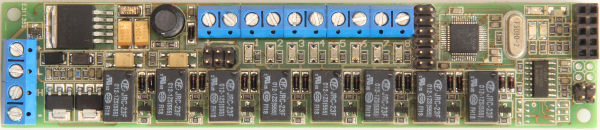
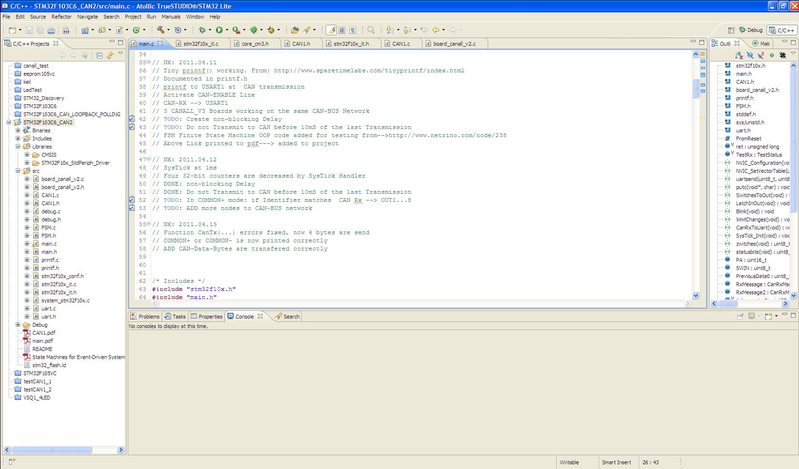
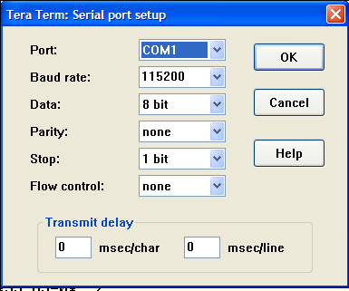
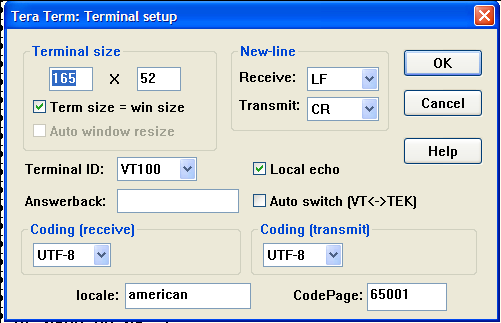
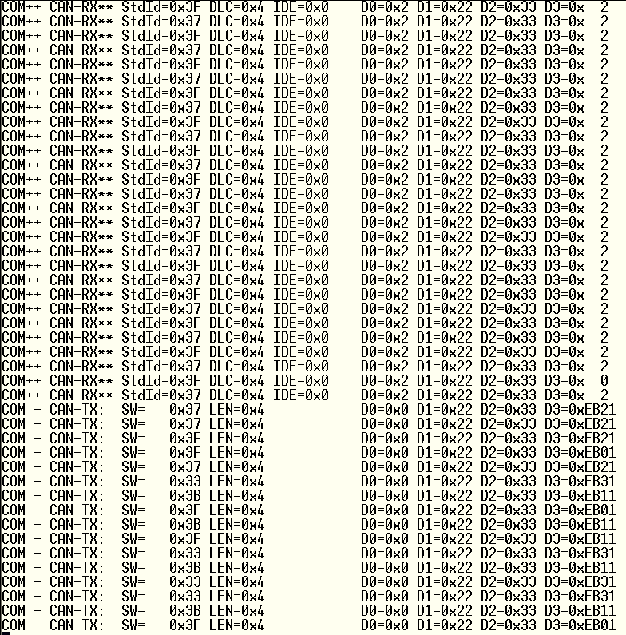
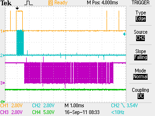
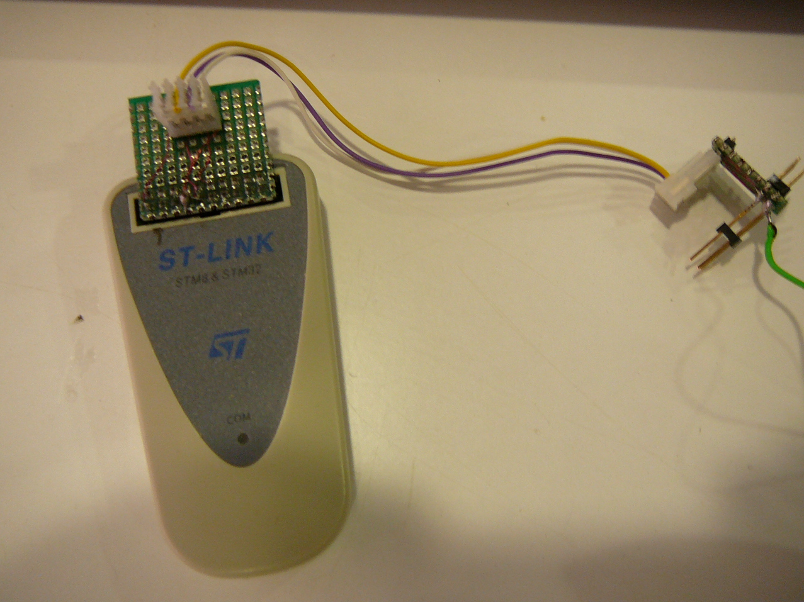

 
 
 

* [wiki](http://www.emboxit.net/mw/index.php?title=Project_STM32F103C6_CAN)
* [wiki secure link](https://www.emboxit.net/mw/index.php?title=Project_STM32F103C6_CAN)
* [tasks](tasks.md)

# STM32F103C6_CAN2
Firmware to test the CAN-BUS operation with [CANALL_V2]() STM32F103C8 based boards 

**Targeting:**

*  Free Tool chain
*  Use no HAL libraries
*  Initialise everything directly to register level
*  Traffic to CAN-BUS only when event happens
*  No HOST, only nodes 

*  canALL_V2 boards connected on CAN-BUS network  

**Software on:** 

  * Atollic TrueSTUDIO®/STM32 Lite, Built on Eclipse.
  * Version: 2.0.1 Lite
  * Build id: 20110128-1032
*  Send to CAN only when an input is changed
*  All Receiving boards transmit to UART
   *  CAN-BUS can be monitored on PC Terminal Emulator  

**On progress:**

   *  Use board addressing to activate outputs from other board inputs
   *  *todo:* In COMMON+ mode, if Identifier matches  CAN Rx --> OUT1...8

## Board

 

## Setup

 

## Atolic IDE

 

## Teraterm  Serial Port Setup

 

## Teraterm Terminal Setup

 

## Teraterm responce

 

## CAN and UART signals

----
At any input change:
* change is transmitted to CAN
* Overall STATUS of the board is transmitted to UART
Osilloscope:
* Blue Channel is CAN-BUS
* Purple Channel is UART-TX

----

## Custom ST-Link and UART adapter

connects:

* ST-LINK to board
* UART to RS232 level translator board and then to PC serial port

 
